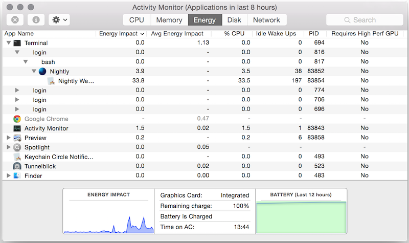
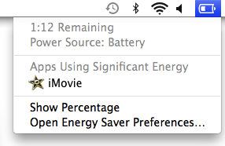

# Activity Monitor, Battery Status Menu and top

This article describes the Activity Monitor, Battery Status Menu, and
`top` --- three related tools available on Mac OS X.

**Note**: The [power profiling overview](power_profiling_overview.md) is
worth reading at this point if you haven't already. It may make parts
of this document easier to understand.

## Activity Monitor

This is a [built-in OS X tool](https://support.apple.com/en-au/HT201464)
that shows real-time process measurements. It is well-known and its
"Energy Impact" measure is likely to be consulted by users to compare
the power consumption of different programs. ([Apple support
documentation](https://support.apple.com/en-au/HT202776) specifically
recommends it for troubleshooting battery life problems.)
***Unfortunately "Energy Impact" is not a good measure for either
users or software developers and it should be avoided.*** Activity
Monitor can still be useful, however.

### Power-related measurements

Activity Monitor has several tabs. They can all be customized to show
any of the available measurements (by right-clicking on the column
strip) but only the "Energy" tab groups child processes with parent
processes, which is useful, so it's the best one to use. The following
screenshot shows a customized "Energy" tab.



The power-related columns are as follows.

-   **Energy Impact** / **Avg Energy Impact**: See the separate section
    below.
-   **% CPU**: CPU usage percentage. This can exceed 100% if multiple
    cores are being used.
-   **Idle wake Ups**:
    -   In Mac OS 10.9 this measured "package idle exit" wakeups. This
        is the same value as
        [powermetrics](/powermetrics.md)'
        "Pkg idle" measurement (i.e.
        `task_power_info::task_platform_idle_wakeups` obtained from the
        `task_info` function.)
    -   In Mac OS 10.10 it appears to have been changed to measure
        interrupt-level wakeups (a superset of idle wakeups), which are
        less interesting. This is the same value as
        [powermetrics](/powermetrics.md)'
        "Intr" measurement (i.e.
        `task_power_info::task_interrupt_wakeups` obtained from the
        `task_info` function.)
-   **Requires High Perf GPU**: Many Macs have two GPUs: a low-power,
    low-performance integrated GPU, and a high-power, high-performance
    external GPU. Using the high-performance GPU can greatly increase
    power consumption, and should be avoided whenever possible. This
    column indicates which GPU is being used.

Activity Monitor can be useful for cursory measurements, but for more
precise and detailed measurements other tools such as
[powermetrics](/powermetrics.md) are better.

### What does "Energy Impact" measure?

"Energy Impact" is a hybrid proxy measure of power consumption.
[Careful
investigation](https://blog.mozilla.org/nnethercote/2015/08/26/what-does-the-os-x-activity-monitors-energy-impact-actually-measure/)
indicates that on Mac OS 10.10 and 10.11 it is computed with a formula
that is machine model-specific, and includes the following factors: CPU
usage, wakeup frequency, [quality of service
class](https://developer.apple.com/library/prerelease/mac/documentation/Performance/Conceptual/power_efficiency_guidelines_osx/PrioritizeWorkAtTheTaskLevel.html)
usage, and disk, GPU, and network activity. The weightings of each
factor can be found in one of the the files in
`/usr/share/pmenergy/Mac-<id>.plist`, where `<id>` can be determined
with the following command.

    ioreg -l | grep board-id

In contrast, on Mac OS 10.9 it is computed via a simpler machine
model-independent formula that only factors in CPU usage and wakeup
frequency.

In both cases "Energy Impact" often correlates poorly with actual
power consumption and should be avoided in favour of direct measurements
that have clear physical meanings.

### What does "Average Energy Impact" measure?

When the Energy tab of Activity Monitor is first opened, the "Average
Energy Impact" column is empty and the title bar says "Activity
Monitor (Processing\...)". After 5--10 seconds, the "Average Energy
Impact" column is populated with values and the title bar changes to
"Activity Monitor (Applications in last 8 hours)". If you have `top`
open during those 5--10 seconds you'll see that `systemstats` is
running and using a lot of CPU, and so presumably the measurements are
obtained from it.

`systemstats` is a program that runs continuously and periodically
measures, among other things, CPU usage and idle wakeups for each
running process. Tests indicate that it is almost certainly using the
same "Energy Impact" formula to compute the "Average Energy Impact",
using measurements from the past 8 hours of wake time (i.e. if a laptop
is closed for several hours and then reopened, those hours are not
included in the calculation.)

## Battery status menu

When you click on the battery icon in the OS X menu bar you get a
drop-down menu that includes a list of "Apps Using Significant Energy".
This is crude but prominent, and therefore worth understanding --- even
though it's not much use for profiling applications.



When you open this menu for the first time in a while it says
"Collecting Power Usage Information" for a few seconds, and if you have
`top` open during that time you'll see that, once again, `systemstats`
is running and using a lot of CPU. Furthermore, if you click on an
application name in the menu Activity Monitor will be opened and that
application's entry will be highlighted. Based on these facts it seems
reasonable to assume that "Energy Impact" is again being used to
determine which applications are "using significant energy".

Testing shows that once an energy-intensive application is started it
takes less than a minute for it to show up in the battery status menu.
And once the application stops using high amounts of energy it takes a
few minutes to disappear. The exception is when the application is
closed, in which case it disappears immediately. And it appears that a
program with an "Energy Impact" of roughly 20 or more will eventually
show up as significant, and programs that have much higher "Energy
Impact" values tend to show up more quickly.

All of these battery status menu observations are difficult to make
reliably and so should be treated with caution. It is clear, however,
that the window used by the battery status menu is measured in seconds
or minutes, which is much less than the 8 hour window used for "Average
Energy Impact" in Activity Monitor.

## `top`

`top` is similar to Activity Monitor, but is a command-line utility. To
see power-related measurements, invoke it as follows.

```
top -stats pid,command,cpu,idlew,power -o power -d
```

**Note**: `-a` and `-e` can be used instead of `-d` to get different
counting modes. See the man page for details.

It will show periodically-updating data like the following.

    PID            COMMAND                  %CPU         IDLEW        POWER
    50300          firefox                  12.9         278          26.6
    76256          plugin-container         3.4          159          11.3
    151            coreaudiod               0.9          68           4.3
    76505          top                      1.5          1            1.6
    76354          Activity Monitor         1.0          0            1.0

-   The **PID**, **COMMAND** and **%CPU** columns are self-explanatory.
-   The **IDLEW** column is the number of "package idle exit" wakeups.
-   The **POWER** column's value is computed by the same formula as the
    one used for "Energy Impact" by Activity Monitor in Mac OS 10.9,
    and should also be avoided.

`top` is unlikely to be much use for power profiling.
